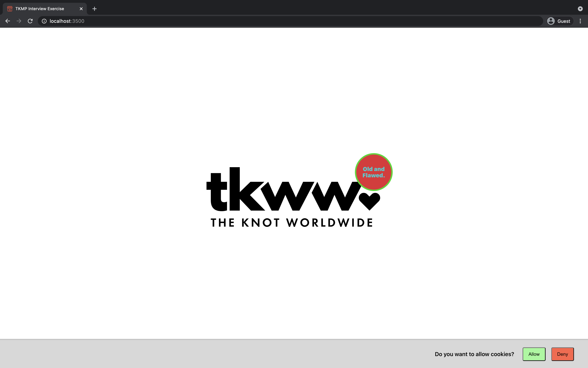
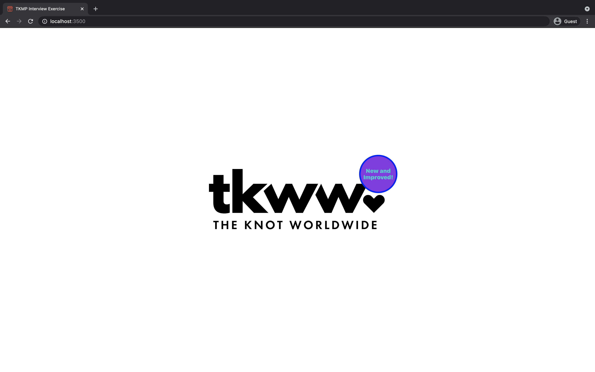
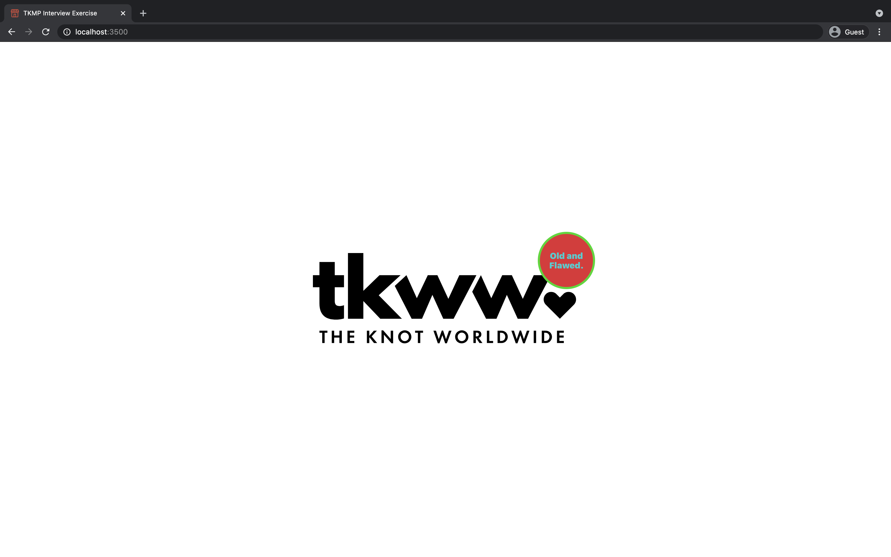

# The Knot Marketplace Interview
## Background

Take a moment to familiarize yourself with the application.

The goal of the application is to have a consent pop up from the bottom of the screen.\
When a user selects 'Allow', they will be able to be randomly assigned into an A/B test.
If they select 'Deny', they should not be assigned a test group.
## Complete Application
| First Visit                                          |
| :--------------------------------------------------- |
|  |

| Test Assignment                                                   | Original Assignment                                                           |
| :---------------------------------------------------------------- | :---------------------------------------------------------------------------- |
|  |  |

## Display Error Wrapper
Each component of the application is wrapped in a `displayErrorWrapper` higher order component. These will help you with debugging. If you notice them in the UI, you may click them to see both the component stack and the call stack of the error. The developer tools console and network tab may also be helpful.
| Error UI                                   |
| :----------------------------------------- |
|  |
## Code to Ignore
All code changes will be within the `src/client` folder and the `src/app/page.jsx` file. All other directories and files can be ignored.

There will be no CSS, HTML or Markdown changes in this exercise. All parts can be solved using only Javascript or Typescript. Typescript is not required.

You may notice `className` being assigned to components: no part of this exercise requires any modification of a `className` prop. Modifying a `className` prop may result in the application displaying in a poor state.
## Exercise
To run the application, clone this repository and run the following from the root of the application.
```
> npm install
> npm run dev
```

Here at The Knot, we believe in pair programming. Talk out your solutions, us as interviewers are here to help - we know the solution, the more you talk, the more we can help.
## Requirements
This exercise requires both `Node` and `npm (included with Node)` to be installed on your local machine. A `.nvmrc` file is available in the project if you prefer to use a Node Version Manager
